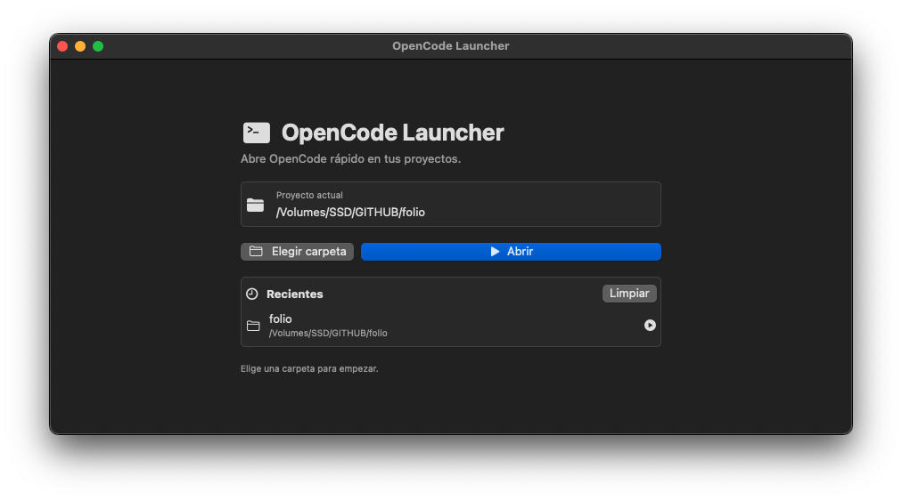

# OpenCode Launcher

A simple native macOS launcher for opening [OpenCode](https://opencode.ai/) directly inside a selected project folder.

Instead of opening your terminal manually, navigating to a folder, and running `opencode`, this app lets you choose a project folder, keeps recent projects, and launches OpenCode automatically using an available terminal app.

## Preview

<p align="center">
  
</p>

## Features

* Native macOS app built with SwiftUI
* Choose any project folder from a clean macOS file picker
* Automatically remembers your last selected project
* Shows recent project folders
* Opens OpenCode with one click
* Automatically detects a compatible terminal
* Supports common macOS terminal apps:

  * Ghostty
  * Kitty
  * WezTerm
  * Alacritty
  * iTerm2
  * Terminal.app
* Lightweight and fast
* No Electron, no background services, no unnecessary bloat

## Why?

OpenCode is usually launched from the terminal:

```bash
cd /path/to/project
opencode
```

That works, but doing it repeatedly can be annoying when jumping between projects.

OpenCode Launcher makes that flow faster:

1. Open the app.
2. Choose a project folder.
3. Click **Open**.
4. Start working in OpenCode.

The goal is to keep the workflow simple, native, and fast.

Make sure `opencode` works from your terminal before using the launcher:

```bash
opencode
```

If macOS apps launched from the Dock cannot find `opencode`, the launcher adds common Homebrew paths automatically:

```bash
/opt/homebrew/bin
/usr/local/bin
/usr/bin
/bin
/usr/sbin
/sbin
```

## Development Notes

This project was made to be simple, readable, and easy to modify.

Some possible future improvements:

* Custom terminal selection
* Drag and drop folder support
* Favorite projects
* Project search
* Custom OpenCode command
* Menu bar mode
* Better app icon
* Automatic update support
* Signed and notarized release builds


## License

MIT License

You are free to use, modify, and share this project.

## Author

Created by Rodrigo Imeri.

This app started as a small personal macOS utility to make opening OpenCode faster and cleaner.
